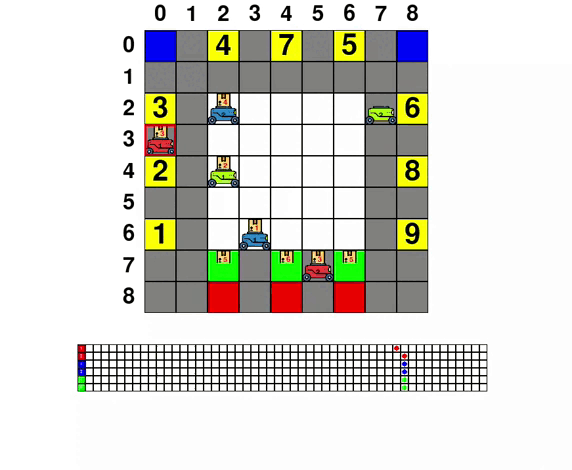

  
# Robotic Board Game 
<h1>Table of Contents</h1>

- [Overview](#overview)
- [Project structure](#project-structure)
- [Game](#game)
  - [What does it look like?](#what-does-it-look-like)
  - [Game rule](#game-rule)
  - [Game parameters](#game-parameters)
  - [Interact with player](#interact-with-player)
- [Player](#player)
  - [Player based on shortest path finding](#player-based-on-shortest-path-finding)
  - [Trainable player](#trainable-player)
- [Usage](#usage)
  - [Installation](#installation)
  - [Simulation](#simulation)
  - [Person-player](#person-player)
# Overview
This library simulates the process of a board game. 
The goal of the simulation is to predict the game process 
statistics depending on various parameters. 
From this, one can conclude which parameters are desirable 
to set in order to play effectively in a real game.
# Project structure
The project has a structure similar to reinforcement learning. 
The game (environment) and the player (agent) are isolated from each other. 
The player observes the environment, receiving observation <b>o</b>, 
and based on that chooses an action <b>a</b>. The game executes action <b>a</b>, 
moves to the next observation, and passes it to the next player. 
The process continues until a win is achieved. This approach allows 
anyone to write an algorithm for an automated player, knowing only 
how the observation looks, without worrying about what happens in the game.
<p align="center">
 
</p>

<p align="center">
<strong>Figure 1: </strong>
<i>The player and the game interact.</i>
</p>

# Game
The game is inspired by real-world applications, in which robots pick-up mail 
and deliver them to a workstation. <b>The goal of all players is to deliver the 
required number of mails as soon as possible.</b>
## What does it look like?
Below example of game between three players. Each of them have 2 robots. 
One move consumes one unit of battery. Every single robot can make maximum 
only one move per turn.
<p align="center">
 
</p>

<p align="center">
<strong>Figure 2: </strong>
<i>Example of game process.</i>
</p>

## Game rule
<table border="1" align="center" cellpadding="10" cellspacing="0">
  <tr>
    <th>Cell's color</th>
    <th>Description</th>
  </tr>
  <tr>
    <td>White</td>
    <td>Cells where player must place robot at the beginning of the game.</td>
  </tr>
  <tr>
    <td>Gray</td>
    <td>Cell where robots can move through and do not have special properties.</td>
  </tr>
  <tr>
    <td>Red</td>
    <td>Cells where the robot cannot be moved to.</td>
  </tr>
  <tr>
    <td>Yellow</td>
    <td>Cells where the robot must deliver the package corresponding 
    to the number of this cell. Only the robot with the correct 
    number of mail can move to the yellow cell. Robot, after dropping off the
    mail, must leave this cell in next turn.</td>
  </tr>
  <tr>
    <td>Green</td>
    <td>Cells where the robot can pick up mail. Only robot without mail can
    move to this cell. Robot, after picking up a mail, must learning this cell in the 
    next turn. </td>
  </tr>
    <tr>
    <td>Blue</td>
    <td>Cells where the robot can be charged. For each move, the robot spends one unit
        of charge. A fully charged robot has N = 50 units of charge. A robot standing 
        on charge receives M = 5 units of charge in one move. To account for the 
        charge, we use special charge cards. At the beginning of the game, all robots 
        are fully charged, which is described by placing the piece corresponding to 
        the robot in the far right position. Then, with each move, the piece moves 
        to the left one square. Only robot with low baterry can move to this cell. Robot after charging to high battery must leave this cell in next turn.
    </td>
  </tr>
</table>

## Game parameters
The robotic board game is parameterized by:
<ul>
  <li>The layout of board.</li>
  <li>The number of required mails.</li>
  <li>The number of players.</li>
  <li>The number of robots for each players.</li>
  <li>Battery is considered or not.</li>
  <li>Randomly set maximum possible step for each robot in every turn or not.</li>
  <li>Maximum step enviroment (our game) can reach.</li>
</ul>

### Custom Layout
You can design a custom board layout with the .csv files, what are accepted as arguments for game contructor. Examples of these files are as follows:

<table border="1" align="center" cellpadding="10" cellspacing="0">
<tr>
  <th>Type map</th>
  <th>Configuration</th>
  <th>Caption</th>
</tr>
<tr>
  <td>Color Map</td>
  <td>
    <pre><code>
  b,g,y,g,y,g,y,g,b
  g,g,g,g,g,g,g,g,g
  y,g,w,w,w,w,w,g,y
  g,g,w,w,w,w,w,g,g
  y,g,w,w,w,w,w,g,y
  g,g,w,w,w,w,w,g,g
  y,g,w,w,w,w,w,g,y
  g,g,gr,g,gr,g,gr,g,g
  g,g,r,g,r,g,r,g,g
    </code></pre>
  </td>
  <td>
  "b" - blue<br/>
  "r" - red<br/>
  "w" - white<br/>
  "g" - gray<br/>
  "gr" - green<br/>
  "y" - yellow
  </td>
</tr>
<tr>
  <td>Target Map</td>
  <td>
    <pre><code>
  0,0,4,0,7,0,5,0,0
  0,0,0,0,0,0,0,0,0
  3,0,0,0,0,0,0,0,6
  0,0,0,0,0,0,0,0,0
  2,0,0,0,0,0,0,0,8
  0,0,0,0,0,0,0,0,0
  1,0,0,0,0,0,0,0,9
  0,0,0,0,0,0,0,0,0
  0,0,0,0,0,0,0,0,0
    </code></pre>
  </td>
  <td> 
  A non-zero number corresponds <br/>
  to the index of the mail <br/>
  that the location receives.
  </td>
</tr>
</table>

### Number of players
Pass to argument ```agent_colors``` a list of colors. For example, passing the list
```python
['r', 'gr', 'b']
``` 
correspond to having red, green and blue players. 
### With battery or not
Movement can waste battery with every single move, or the robot can always be fully charged. You can set this option by using the argument ```with_battery``` when constructing the game.
### The maximum possible number of moves for the robot in each turn is set randomly or not
In each turn, player can optionally move the robot several steps, but not exceed a certain number. This number can be either 1 or set randomly. You can adjust this with argument ```random_steps_per_turn``` when constructing the game.
### Maximum step enviroment can reach
A game can be played infinitely. Set maximum step that game can reach with argument ```
max_step```.
## Interact with player
### Observation Space
The observation is a dictionary which contains an ```'observation'``` element which 
is the usual RL observation described below, and an ```'action_mask'``` which holds 
the legal moves, described in the Legal Actions Mask section.

Observation of the single robot is the vector with size 4. 
It contains respectively  x-coordinate, y-coordinate, mail's number, 
battery of that robot. All components are normalized for passing to neural 
networks. Observations of all robots are concatenated to create main observation. 
The observation of the robot that is being controlled is placed first in the main 
observation vector i.e. first four components of the main observation is the 
observation of the controlled robot. This ensure possibility of self-play, one agent 
can play as all players because it always provides action for the robot with the 
observation in the first position of the main observation.

For example, for first robot enviroment provides vector:
$$
\begin{pmatrix}
x_1 \\
y_1 \\
m_1 \\
b_1 \\
x_2 \\
y_2 \\
m_2 \\
b_2 \\
x_3 \\
y_3 \\
m_3 \\
b_3 \\
...
\end{pmatrix}
$$
For second robot:
$$
\begin{pmatrix}
x_2 \\
y_2 \\
m_2 \\
b_2 \\
x_1 \\
y_1 \\
m_1 \\
b_1 \\
x_3 \\
y_3 \\
m_3 \\
b_3 \\
...
\end{pmatrix}
$$
For third robot:
$$
\begin{pmatrix}
x_3 \\
y_3 \\
m_3 \\
b_3 \\
x_1 \\
y_1 \\
m_1 \\
b_1 \\
x_2 \\
y_2 \\
m_2 \\
b_2 \\
...
\end{pmatrix}
$$
and so on.
### Legal Actions Mask 
The legal moves available to the current agent are found in the ```action_mask``` element 
of the dictionary observation. The ```action_mask``` is a binary vector where each index 
of the vector represents whether the action is legal or not.
### Action Space
5 actions are available for each robot:

<table border="1" align="center" cellpadding="10" cellspacing="0">
  <tr>
    <th>Action ID</th>
    <th>Action</th>
  </tr>
  <tr>
    <td>0</td>
    <td>Stand still. Charge if possible.</td>
  </tr>
  <tr>
    <td>1</td>
    <td>Make move foward. Pick up or drop off if possible.</td>
  </tr>
  <tr>
    <td>2</td>
    <td>Make move backward. Pick up or drop off if possible.</td>
  </tr>
  <tr>
    <td>3</td>
    <td>Make move to left. Pick up or drop off if possible.</td>
  </tr>
  <tr>
    <td>4</td>
    <td>Make move to right. Pick up or drop off if possible.</td>
  </tr>
</table>

# Player
## Player based on shortest path finding
This agent loads states of robots from observation to a local graph and make decision 
by setting destination for robot and finding shortest path to this.

Algorithm for controlling single robot is described below:
<p align="center">
 
</p>

<p align="center">
<strong>Figure 3: </strong>
<i>Algorithm for controlling single robot.</i>
</p>

> ***:** A cell is considered blocked if a robot is standing on it and only 1 of its neighbors is free. Agent decides that the robot will stop waiting if the destination is occupied. Therefore, if all the neighboring cells of the destination are occupied by waiting robots, the robot at the destination will not be able to exit that cell. All the robots will stop waiting for each other and the game cannot continue.

Algorithm for chosing destination is described below:
<p align="center">
 
</p>

<p align="center">
<strong>Figure 4: </strong>
<i>Algorithm for chosing destination.</i>
</p>

## Trainable player
We combine below RL methods to training agent by self-play:
<ul>
  <li>Double DQN</li>
  <li>Dueling DQN</li>
  <li>Prioritized Experience Replay</li>
  <li>Multi-step DQN</li>
</ul>

It works for enviroment with 2, 3, 4 but for enviroment with more robots, agent need to be trained more. You can train agent by running file ```train.py``` with default parameters for agent and paramters for enviroment that will be described in Usage section.

> **Note:** This option in the process of improvement and upgrade.

# Usage

## Installation
You can install the project following these steps:
- Use Git to download:
```
git https://github.com/nguyenthanhtrung2910/RoboticsBoardGame.git
cd RoboticsBoardGame
```
- Create virtual enviroment:
```
python3 -m venv .env
```
- Activate it:
```
source .env/bin/activate
``` 
- Install required library by command:

```
pip install -r requirements.txt
```

## Simulation
The lines below show you how to simulate game process, running game between players.
Now available only game process between players based on shortest path finding.

To run the game, run file ```main.py``` with following arguments:

<table border="1" align="center" cellpadding="40" cellspacing="0">
  <tr>
    <th>Argument</th>
    <th>Default</th>
    <th>Decription</th>
  </tr>
  <tr>
    <td style="white-space: nowrap;">
    <code>--color_map</code></td>
    <td><code>assets/csv_files/colors_map.csv</code></td>
    <td>Path for csv color map file.</td>
  </tr>
  <tr>
    <td style="white-space: nowrap;">
    <code>--target_map</code></td>
    <td><code>assets/csv_files/targets_map.csv</code></td>
    <td>Path for csv target map file.</td>
  </tr>
  <tr>
    <td style="white-space: nowrap;">
    <code>--required_mail</code></td>
    <td></td>
    <td>Required number of mails in order to win.</td>
  </tr>
  <tr>
    <td style="white-space: nowrap;">
    <code>--robot_colors</code></td>
    <td></td>
    <td>Colors of players. Allowed player's colors: ,<code>r</code> : red, <code>b</code> :blue, <code>gr</code> :green, <code>y</code> :yellow, <code>o</code> : orange.</td>
  </tr>
  <tr>
    <td style="white-space: nowrap;">
    <code>--number_robots_per_player</code></td>
    <td><code>1</code></td>
    <td>Number robots per player.</td>
  </tr>
  <tr>
    <td style="white-space: nowrap;">
    <code>--with_battery</code></td>
    <td><code>False</code></td>
    <td>Battery is considered or not.</td>
  </tr>
  <tr>
    <td style="white-space: nowrap;">
    <code>--random_steps_per_turn</code></td>
    <td><code>False</code></td>
    <td>The maximum possible number of moves for the robot in each turn is set randomly or not.</td>
  </tr>
  <tr>
    <td style="white-space: nowrap;">
    <code>--max_step</code></td>
    <td><code>800</code></td>
    <td>Maximum enviroment step.</td>
  </tr>
  <tr>
    <td style="white-space: nowrap;">
    <code>--render_mode</code></td>
    <td><code>human</code></td>
    <td>Run with animation or not. Can be <code>human</code> or <code>None</code>.</td>
  </tr>
  <tr>
    <td style="white-space: nowrap;">
    <code>--number_persons</code></td>
    <td><code>0</code></td>
    <td>Number of person-players.</td>
  </tr>
  <tr>
    <td style="white-space: nowrap;">
    <code>--number_run</code></td>
    <td><code>1</code></td>
    <td>How many times the game is runned.</td>
  </tr>
</table>

For example:
```bash
python3 main.py --required_mail 10 --robot_colors r b --number_run 5 > results.txt
```
Results is winner and game's time of every run.

## Person-player
You can enter actions from keyboard, playing with yourself or with other.
<table border="1" align="center" cellpadding="10" cellspacing="0">
  <tr>
    <th>Button</th>
    <th>Action ID</th>
    <th>Action</th>
  </tr>
  <tr>
    <td style="font-size: 20px; text-align: center; vertical-align: middle;
    "><code>space</code></td>
    <td>0</td>
    <td>Stand still. Charge if possible.</td>
  </tr>
  <tr>
    <td style="font-size: 30px; text-align: center; vertical-align: middle;">&uarr;</td>
    <td>1</td>
    <td>Make move foward. Pick up or drop off if possible.</td>
  </tr>
  <tr>
    <td style="font-size: 30px; text-align: center; vertical-align: middle;">&darr;</td>
    <td>2</td>
    <td>Make move backward. Pick up or drop off if possible.</td>
  </tr>
  <tr>
    <td style="font-size: 30px; text-align: center; vertical-align: middle;">&larr;</td>
    <td>3</td>
    <td>Make move to left. Pick up or drop off if possible.</td>
  </tr>
  <tr>
    <td style="font-size: 30px; text-align: center; vertical-align: middle;">&rarr;</td>
    <td>4</td>
    <td>Make move to right. Pick up or drop off if possible.</td>
  </tr>
</table>

You can't switch to other robot until you enter legal move or there no move is legal.