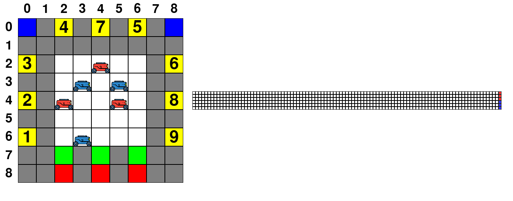

  
# Robotic Board Game with rendering by Pygame 

## Description:
The game describes the process of sorting mail by delivery directions using delivery robots.

## Rules:
Robots move across the playing field horizontally and vertically. Diagonal movements are prohibited. On the playing field, points are marked in green where robots can pick up mails to deliver them to destinations, colored yellow and numbered from 1 to 9 (the number and numbering order may differ for different fields).

Chargers are marked in blue. For each move, the robot spends one unit of charge. A fully charged robot has $N = 100$ units of charge. A robot standing on charge receives $M = 10$ units of charge in one move. A fully charged robot must leave the charger. The robot can leave the charger at any time without waiting for a full charge. To account for the charge, we use special charge cards. At the beginning of the game, all robots are fully charged, which is described by placing the piece corresponding to the robot in the far right position. Then, with each move, the piece moves to the left one square.

Fields where the robot cannot be moved are marked in red. The white square in the center is the zone into which at the beginning of the game you can introduce your robot. Squares that robots can move through and those that do not have special properties are marked in gray. At the beginning of the game, each player takes turns placing a robot within the boundaries of the white square.

After all the pieces have been placed, each player takes turns
performs a move, moving each of his robots 1 space.
If a robot is blocked (all neighboring cells are taken by other robots), it skips this move. Only robots with mail, whose numbers correspond to the field number are allowed to enter the yellow field. As soon as the robot with the mail leaves the green cell, the player who owns the robot rolls two dices and places a mail with a number corresponding to the rolled sum of points on the vacated green cell. If the corresponding number is not on the playing field, the dice are re-rolled. The game ends as soon as one of the players collects the required number of mails. If all player don't want to move anymore or no legal move so Draw. 
## How to install:
Create virtual enviroment:
```
python3 -m venv .env
```
Activate it:
```
source .env/bin/activate
``` 
Install required library by command:

```
pip install -r requirements.txt
```
## How to run:
Run python file main.py with followed arguments: 
### Arguments:
``--color_map``: path for csv color map file. <br/>
``--targte_map``: path for csv target map file. <br/>
``--required_mail``: number requried mails in order to win, it shouldn't more than 5.<br/> 
``--number_robots_with_same_color``: number robots for each player. <br/>
``--robot_colors``: colors for robots on board.<br/>
``--number_auto_player``: number auto player.<br/>
Allowed player's colors: ``r`` : red, ``b`` :blue, ``g`` :green, ``y`` :yellow, ``o`` : orange.<br/>

Game can have less than 5 players.
### Example:
```
python3 main.py --color_map csv_files/colors_map.csv --target_map csv_files/targets_map.csv --required_mail 20 --number_robots_with_same_color 3 --robot_colors r b --number_auto_players 2

```
## Buttons detail:
### Play with below buttons:<br/>
$\uparrow$: Move up. <br/>
$\downarrow$: Move up. <br/>
$\rightarrow$: Move right. <br/>
$\leftarrow$: Move left. <br/>
``F`` : Finish your turn. We also can finish our turn when we haven't moved all robot but we must move all fully charged robots, located in blue cell before finishing our turn.<br/>
When all your robots have done their moves, keyboard is blocked. You must press ``F`` key to finish your turn. <br/>
``1``,``2``,``3``,... : Chose your robot to move.<br/>

Game's process is writen in file ``events.log``. 

## About First Policy:
In fact, player and game are isolated objects so Agent class can not have reference to Game's object. Agent receive state from Game, simulate next state and from that generate action.
Agent have his own simulator in order to simulate the game. 

Our board changes every step so we need search shortest path to destination for each robot every movement. I use A* algorithm for shortest path searching. When robot reach its destination, it changes its destination to new destination. Robot need to charge if its baterry less than 30 and get ready to go if its battery more than 70.