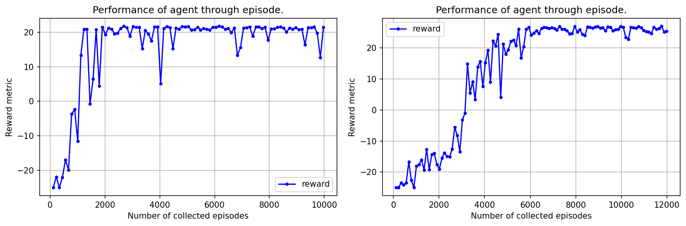
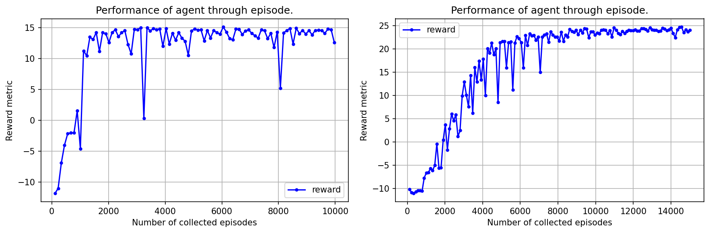
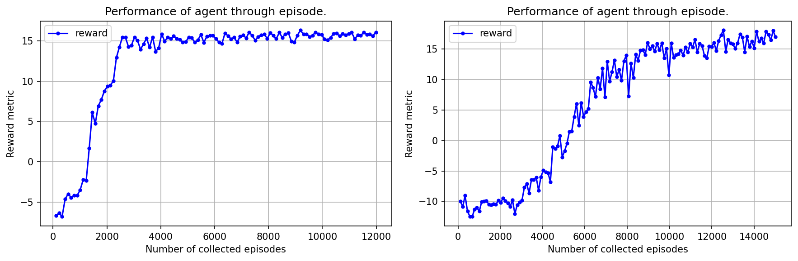

Training results reporting
==========================

We want to observe the game with different sets of parameters. So we trained agents for different cases of 
the parameters. More specifically, we trained agents for the game with the following number of robots: 
2, 3, 4, 6, 8, 9, 12. For each of these cases, there are two sub-cases: whether the robot moves with battery 
power or not.

As we mentioned in the :doc:`previous section <self-play>`, in decentralized method, we train agents independently 
in training phase and in test phase, they can play together as one team. So, for example, for case with 4 player and 
each of them have 2 robots, we can use pre-trained agent on the board with 8 robots.

Following hyper-paramters is set for training in game with different number robots and the battery option:

.. table:: DQN hyper-parameters.
   :align: center

   +------------------------------------------------------+------------+
   |Parameter                                             |Value       |
   +======================================================+============+
   |Discount factor                                       |0.99        |
   +------------------------------------------------------+------------+
   |Adam learning rate                                    |0.0001      |
   +------------------------------------------------------+------------+
   |Exploration :math:`\epsilon`                          |1.0 → 0.05  |
   +------------------------------------------------------+------------+
   |Prioritization type                                   |proportional|
   +------------------------------------------------------+------------+
   |Prioritization exponent :math:`\alpha`                |0.6         |
   +------------------------------------------------------+------------+
   |Prioritization importance sampling :math:`\beta`      |0.4 → 1.0   |
   +------------------------------------------------------+------------+
   |Multi-step returns :math:`n`                          |30          |
   +------------------------------------------------------+------------+

Training results is below:

   Results of training agent by self-play in the field that have 2 robots.
   Robot moves without considering battery and need to collect 4 mails to win - left.
   Robot moves with considering battery and need to collect 6 mails to win - right.
   Maximum environment step is 500.

   Results of training agent by self-play in the field that have 3 robots.
   Robot moves without considering battery and need to collect 4 mails to win - left.
   Robot moves with considering battery and need to collect 6 mails to win - right.
   Maximum environment step is 500.

   Results of training agent by self-play in the field that have 4 robots.
   Robot moves without considering battery and need to collect 4 mails to win - left.
   Robot moves with considering battery and need to collect 6 mails to win - right.
   Maximum environment step is 500.

   Results of training agent by self-play in the field that have 6 robots.
   Robot moves without considering battery and need to collect 4 mails to win - left.
   Robot moves with considering battery and need to collect 6 mails to win - right.
   Maximum environment step is 800.

.. figure:: ../../_static/results-8.png
   :width: 800px
   :align: center

   Results of training agent by self-play in the field that have 8 robots.
   Robot moves without considering battery and need to collect 4 mails to win - left.
   Robot moves with considering battery and need to collect 6 mails to win - right.
   Maximum environment step is 1000.

   Results of training agent by self-play in the field that have 9 robots.
   Robot moves without considering battery and need to collect 4 mails to win - left.
   Robot moves with considering battery and need to collect 6 mails to win - right.
   Maximum environment step is 1200.

   Results of training agent by self-play in the field that have 12 robots.
   Robot moves without considering battery and need to collect 4 mails to win - left.
   Robot moves with considering battery and need to collect 6 mails to win - right.
   Maximum environment step is 1500.

The metric reward is the average of the rewards of all agents of all measured episodes 
in both cases. In this experiment, we combine following algorithms as we showed you in
:doc:`previous section <self-play>`.

* `Deep Q-Network <https://arxiv.org/pdf/1312.5602>`_.
* `Double DQN <https://arxiv.org/pdf/1509.06461>`_.
* `Dueling DQN <https://arxiv.org/pdf/1511.06581>`_.
* `Prioritized Experience Replay <https://arxiv.org/abs/1511.05952>`_.
* `Multi-step DQN <https://arxiv.org/pdf/1901.07510>`_.

In case with battery, agent need to learn to control robots that not only deliver mails to destination 
but also charge their battery when battery run low. So we have slower convergence.
