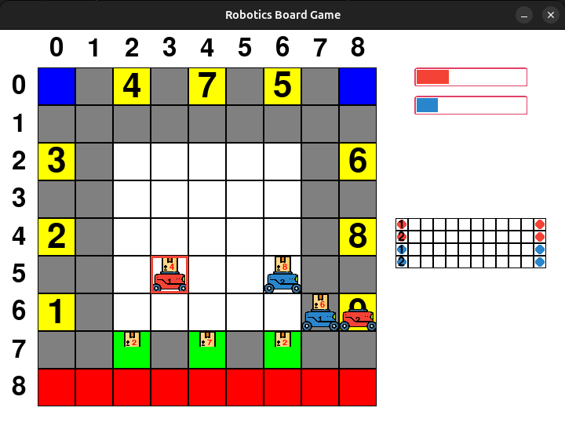

Animation
=========

In this section, we visualize the game process. It loads pre-trained model to 
see how it acts after training so if you want to use it, you have to download our 
folder of pre-trained models here and save it in same directory with file :code:`animate.py`.
Otherwise program can't find checkpoints to load.

Now it's compatible with only built-in agents. For user-defined agent, we will adaptive after.

To run animation, simply run file :code:`animate.py`:

.. code-block:: bash

    python animate.py

It will show you below screen:

   Introdution screen

You can right away run with default configuration by clicking **Play** or click **Setting**
to edit it:

   Setting screen

All players use :doc:`DQN agent <rl_agent>` by default. You can chose **astar** if you want to 
use :doc:`agent using A* path finding algorithm <astar_agent>` or **person** if you want 
play by yourself.

Click **OK** to back to main menu and now click **Play** to animate with new configuration:

   Game process screen. Bar progress in top-right corner shows how many mails player has 
   collected. Grid in bottom-right corner shows batteries of the robots.

If you play by yourself, table following will show you how to:

.. table:: 
    :align: center

    +---------------+--------+----------------------------------------------------+
    |Button         |Acton ID|Action                                              |
    +===============+========+====================================================+
    | **space**     | 0      |Stand still. Charge if possible.                    |
    +---------------+--------+----------------------------------------------------+
    | ↑             | 1      |Make move foward. Pick up or drop off if possible.  |
    +---------------+--------+----------------------------------------------------+
    | ↓             | 2	     |Make move backward. Pick up or drop off if possible.|
    +---------------+--------+----------------------------------------------------+
    | ←             | 3	     |Make move to left. Pick up or drop off if possible. |
    +---------------+--------+----------------------------------------------------+
    | →             | 4	     |Make move to right. Pick up or drop off if possible.|
    +---------------+--------+----------------------------------------------------+

|