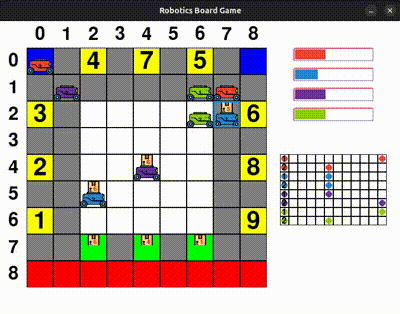

Environment
===========

The robotic board game environment simulates a board game with robots moving and delivering mails to their destinations.
The robotic board game environment is parameterized. See its details below.

What does it look like?
-----------------------
Below rendered example of game between four players. Each of them have 2 robots. One move consumes one unit of battery. Every 
single robot can make maximum only one move per turn.

    Robotic board game example.

Game rule
---------
The board game is inspired by real-world applications, in which robots pick-up mail and deliver them to a workstation. 
On own turn, the player moves the robot a few cells (how many we decide by parameter) and tries to deliver the 
required number of mails as soon as possible.

The next table show you details of the field, in which player moves his own robots.

.. table:: Cell description.
    :align: center

    +---------------------+-------------------------------------------------------------------------------------+
    | Color of the cell   | Description                                                                         |
    +=====================+=====================================================================================+
    | White               | At the beginning of the game, robots are randomly placed in a white cell.           |
    +---------------------+-------------------------------------------------------------------------------------+
    | Gray                | Robot can move through gray cell and it doesn't have special properties.            |
    +---------------------+-------------------------------------------------------------------------------------+
    | Red                 | Robot can't move to red cell.                                                       |
    +---------------------+-------------------------------------------------------------------------------------+
    | Yellow              | | Each yellow cell has a number written on it. Only the robot with the mail         | 
    |                     | | that has corresponding index can move to yellow cell and drop off the mail.       |
    |                     | | Robot, after dropping off the mail, must leave this cell in next turn.            |
    +---------------------+-------------------------------------------------------------------------------------+
    | Green               | | Robot can pick up a mail in green cell. Only robot without mail can move to       | 
    |                     | | green cell. Robot, after picking up a mail, must leave this cell in the next turn.|
    +---------------------+-------------------------------------------------------------------------------------+
    | Blue                | | Robot can be charged in blue cell. For every five steps, the robot consumes       | 
    |                     | | 1 battery unit. A fully charged robot has N = 10 battery units. The charging      |
    |                     | | robot receives 1 battery unit for every step another robot takes. At the          |     
    |                     | | beginning of the game, all robots are fully charged. Only robot with low          |
    |                     | | baterry can move to blue cell. Robot after charging to high battery must          |
    |                     | | leave this cell in next turn.                                                     |                                            
    +---------------------+-------------------------------------------------------------------------------------+

Game parameters
---------------

The robotic board game is parameterized by:

* The layout of board.
* The required number of mails.
* The number of players.
* The number of robots for each players.
* Battery of robot is considered or not.
* Robot can move maximum 1 step per turn or randomly set that number.
* Maximum step environment (our game) can reach.

Layout of the board is set with the .csv files, what are accepted as arguments for game contructor. 
Examples of these files are as follows:

.. table:: Board layout example.
    :align: center

    +-----------------+-------------------------------------------------+------------------------------------+
    |    Type map     |             Configuration                       |  Caption                           | 
    +=================+=================================================+====================================+
    |    Color Map    | .. code-block::                                 | | "b" - blue                       |
    |                 |                                                 | | "r" - red                        |
    |                 |       b,g,y,g,y,g,y,g,b                         | | "w" - white                      |
    |                 |       g,g,g,g,g,g,g,g,g                         | | "g" - gray                       |
    |                 |       y,g,w,w,w,w,w,g,y                         | | "gr" - green                     |
    |                 |       g,g,w,w,w,w,w,g,g                         | | "y" - yellow                     |
    |                 |       y,g,w,w,w,w,w,g,y                         |                                    |
    |                 |       g,g,w,w,w,w,w,g,g                         |                                    |
    |                 |       y,g,w,w,w,w,w,g,y                         |                                    |
    |                 |       g,g,gr,g,gr,g,gr,g,g                      |                                    |
    |                 |       g,g,r,g,r,g,r,g,g                         |                                    |
    +-----------------+-------------------------------------------------+------------------------------------+
    |    Target Map   | .. code-block::                                 | | A non-zero number corresponds    |
    |                 |                                                 | | to the index of the mail         |
    |                 |       0,0,4,0,7,0,5,0,0                         | | that the location receives.      |
    |                 |       0,0,0,0,0,0,0,0,0                         |                                    |
    |                 |       3,0,0,0,0,0,0,0,6                         |                                    |
    |                 |       0,0,0,0,0,0,0,0,0                         |                                    |
    |                 |       2,0,0,0,0,0,0,0,8                         |                                    |
    |                 |       0,0,0,0,0,0,0,0,0                         |                                    |
    |                 |       1,0,0,0,0,0,0,0,9                         |                                    |
    |                 |       0,0,0,0,0,0,0,0,0                         |                                    |
    |                 |       0,0,0,0,0,0,0,0,0                         |                                    |
    +-----------------+-------------------------------------------------+------------------------------------+

Other parameters you can pass directly to contructor. For example:

.. code-block:: python

    from rbgame.game.game import RoboticBoardGame
    game = RoboticBoardGame(
        colors_map='assets/csv_files/colors_map.csv', 
        targets_map='assets/csv_files/targets_map.csv', 
        # 10 mails to win
        required_mail=10, 
        # red, blue, green and purple players
        robot_colors=['r', 'b', 'gr', 'p'],
        # each player have 2 robot
        num_robots_per_player=2,
        # battery is considered
        with_battery=True,
        # robot can move maximum one step per turn
        random_num_steps=False,
        # maximum environment step
        max_step=1000,
    ),

For more details, please access the API reference.

Observation space
-----------------

The observation is a dictionary which contains an ``'observation'`` element which 
is the usual reinforcement learning observation described below, and an ``'action_mask'`` which holds 
the legal moves, described in the Legal Actions Mask section.

Observation of the single robot is the vector with size 4. 
It contains respectively  x-coordinate, y-coordinate, mail's index, 
battery of that robot. All components are normalized for passing to neural 
networks. Observations of all robots are concatenated to create main observation. 
For each specific agent, the observation of the robot that is being controlled is placed 
first in the main observation vector i.e. first four components of the main 
observation is the observation of the controlled robot. 
This ensure possibility of self-play, one agent can play as all robots because 
it always controls robot with first four features of main observation.
Beside, this allow agent learn from not only its own transitions but also 
from transitions of other agents.

For example, with notation that :math:`(x_i, y_i), m_i, b_i` is coordinates, mail's index and
battery of :math:`i`-th robot respectively, for agent that controls first robot, environment 
provides vector:

.. math::

    \vec{o} = 
    \begin{pmatrix}
    x_1 \\
    y_1 \\
    m_1 \\
    b_1 \\
    x_2 \\
    y_2 \\
    m_2 \\
    b_2 \\
    x_3 \\
    y_3 \\
    m_3 \\
    b_3 \\
    ...
    \end{pmatrix}

For agent that controls second robot:

.. math::

    \vec{o} = 
    \begin{pmatrix}
    x_2 \\
    y_2 \\
    m_2 \\
    b_2 \\
    x_1 \\
    y_1 \\
    m_1 \\
    b_1 \\
    x_3 \\
    y_3 \\
    m_3 \\
    b_3 \\
    ...
    \end{pmatrix}

For agent that controls third robot:

.. math::

    \vec{o} = 
    \begin{pmatrix}
    x_3 \\
    y_3 \\
    m_3 \\
    b_3 \\
    x_1 \\
    y_1 \\
    m_1 \\
    b_1 \\
    x_2 \\
    y_2 \\
    m_2 \\
    b_2 \\
    ...
    \end{pmatrix}

and so on.

Legal actions mask
------------------

The legal moves available to the current agent are found in the ``'action_mask'`` element 
of the dictionary observation. The ``'action_mask'`` value is a binary vector where each element
of the vector represents whether the action is legal or not.

Action space
------------

In this simulation, 5 discrete actions are available for each robot:

.. table:: Possible actions.
    :align: center

    +-----------+-----------------------------------------------------+
    | Action ID | Action                                              |
    +===========+=====================================================+
    | 0         | Stand still. Charge if possible.                    |
    +-----------+-----------------------------------------------------+
    | 1         | Make move foward. Pick up or drop off if possible.  |
    +-----------+-----------------------------------------------------+
    | 2         | Make move backward. Pick up or drop off if possible.|
    +-----------+-----------------------------------------------------+
    | 3         | Make move to left. Pick up or drop off if possible. |
    +-----------+-----------------------------------------------------+
    | 4         | Make move to right. Pick up or drop off if possible.|
    +-----------+-----------------------------------------------------+

Reward
------

Even with the simplest parameters, agent will not learn anything if 
reward is too sparse. So let have a Curriculum Learning. 
Our reward system could be defined as follows:

* Pick up a mail = 1
* Drop off a mail = 5
* Go to blue cell to charge = 1
* Otherwise = -0.1 to encourage the agent to try to complete as soon as possible.

For more details, please access the :mod:`API reference <rbgame.game>`.

