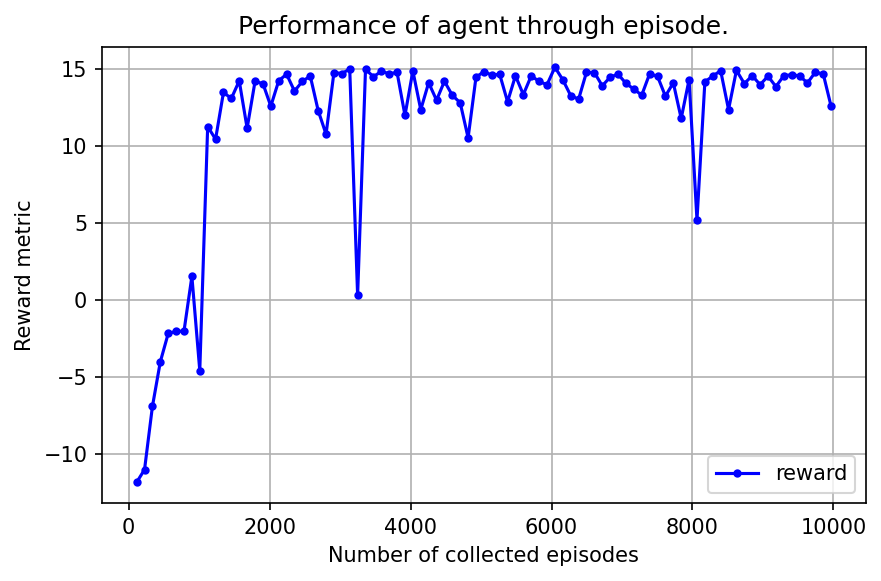
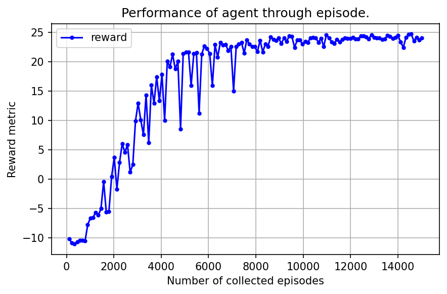

Trainable agent using Reinforcement Learning algorithms
=======================================================

Using reinforcement learning algorithms gives us some advantages:

* Agent is trainable so it's smarter 😀.
* Agent can parallel play in many enviroment because neural network 
  accepts a batch of observations as input.

In Reinforcement Learning we have process: 

.. figure:: _static/agent_and_env_diag.svg
    :align: center
    :alt: The interaction between the environment and the agent.
    :width: 600

    The interaction between the environment and the agent.

Here is what happen:

* At a given time step :math:`t`, the environment is in a state :math:`\boldsymbol{s_t}`, which results in the observation :math:`\boldsymbol{o_t}`.

* Based on :math:`\boldsymbol{o_t}` and its internal policy function, the agent calculates an action :math:`\boldsymbol{a_t}`.

* Based on both the state :math:`\boldsymbol{s_t}` and the action :math:`\boldsymbol{a_t}`, and according to its internal dynamics, 
  the environment updates its state to :math:`\boldsymbol{s_{t+1}}`, which results in the next observation :math:`\boldsymbol{o_{t+1}}`

* Based on :math:`\boldsymbol{s_t}`, :math:`\boldsymbol{a_t}`, and :math:`\boldsymbol{s_{t+1}}`, the environment also calculates a scalar reward :math:`\boldsymbol{r_t}` and flag :math:`\boldsymbol{done}`
  , which shows whether the environment ends at the current step or not. The reward is an immediate measure of how good the action :math:`\boldsymbol{a_t}` is.

* Transition :math:`(\boldsymbol{o_t}, \boldsymbol{a_t}, \boldsymbol{o_{t+1}}, \boldsymbol{r_t}, \boldsymbol{done})` is saved to its memory (or replay buffer).

* At the next time step :math:`t+1` the agent receives the observation :math:`\boldsymbol{o_{t+1}}` to generate next action :math:`\boldsymbol{a_{t+1}}`
  and the process is repeated.

* After specific number of steps, agent samples transitions from memory and update its policy based on sampled transitions.
  How many transitions are sampled and how agent update policy? It depends on difference algorithms.

Simply, policy is neural network with 2 main methods:

* :py:meth:`forward`, what shows how policy can provide action based on the input observation.
* :py:meth:`update`, what shows how policy can update its networks.

For policies implementions, we use friendly and easy customizable library `tianshou <https://tianshou.org/en/stable/index.html>`_.

For now, we're using decentralized method which mean each agent only learn to optimize its own reward, 
they're not concerned about what other do. Therefore, in training phase, we train robots independently and in test phase, 
they can play together as one team. For example, we train 8 robots and after that, we let 4 robots play in one team. 

We provides a notebook to show you how you can train an agent by self-play with our :py:class:`DecentralizedTrainer`.
In this site, we will only show some results:

   Results after 10000 episodes of training agent by self-play in the field that have 4 robots.
   Robot moves without considering battery and need to collect 4 mails to win, maximum enviroment 
   step is 500.

   Results after 15000 episodes of training agent by self-play in the field that have 4 robots.
   Robot moves consuming battery and need to collect 6 mails to win, maximum enviroment 
   step is 500. 

The metric reward is the average of the rewards of all agents of all measured episodes 
in both cases. In this experiment, we combine following algorithm:

* `Deep Q-Network <https://arxiv.org/pdf/1312.5602>`_
* `Double DQN <https://arxiv.org/pdf/1509.06461>`_
* `Dueling DQN <https://arxiv.org/pdf/1511.06581>`_
* `Prioritized Experience Replay <https://arxiv.org/abs/1511.05952>`_
* `Multi-step DQN <https://arxiv.org/pdf/1901.07510>`_

And the hypers-parameters:

+------------------------------------------------------+------------+
|Parameter                                             |Value       |
+======================================================+============+
|Adam learning rate                                    |0.0001      |
+------------------------------------------------------+------------+
|Exploration :math:`\epsilon`                          |1.0 → 0.05  |
+------------------------------------------------------+------------+
|Prioritization type                                   |proportional|
+------------------------------------------------------+------------+
|Prioritization exponent :math:`\alpha`                |0.6         |
+------------------------------------------------------+------------+
|Prioritization importance sampling :math:`\beta`      |0.4 → 1.0   |
+------------------------------------------------------+------------+
|Multi-step returns :math:`n`                          |30          |
+------------------------------------------------------+------------+

In second case, agent need to learn to control robots that not only deliver mails to destination 
but also charge their battery when battery run low. So we have slower convergence.
